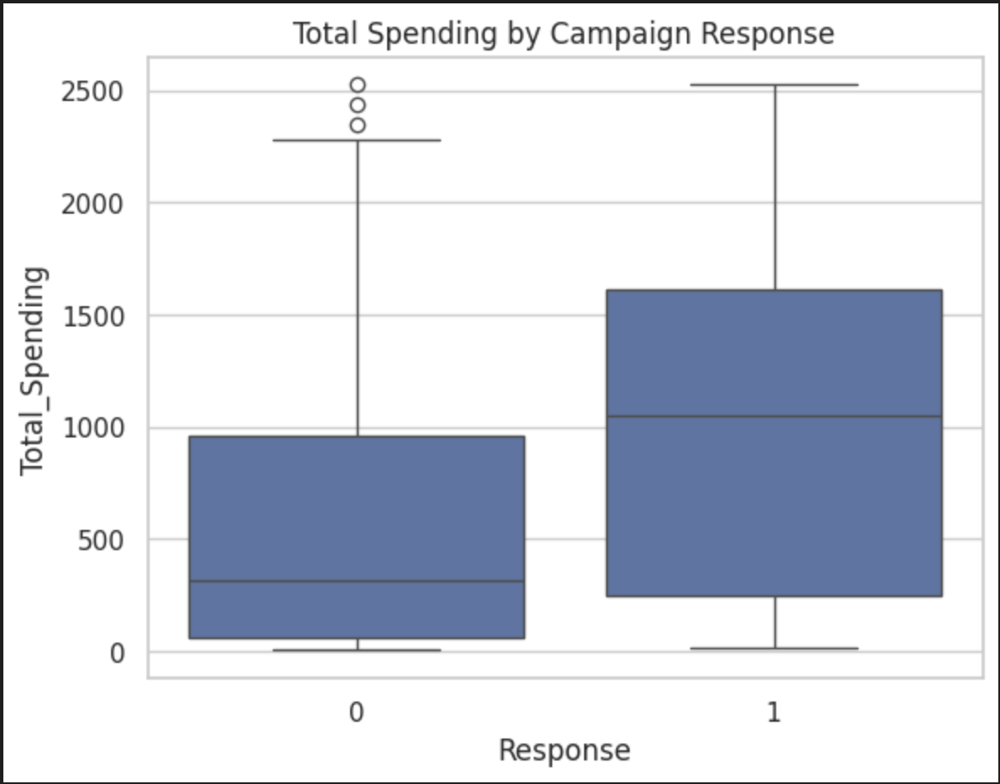
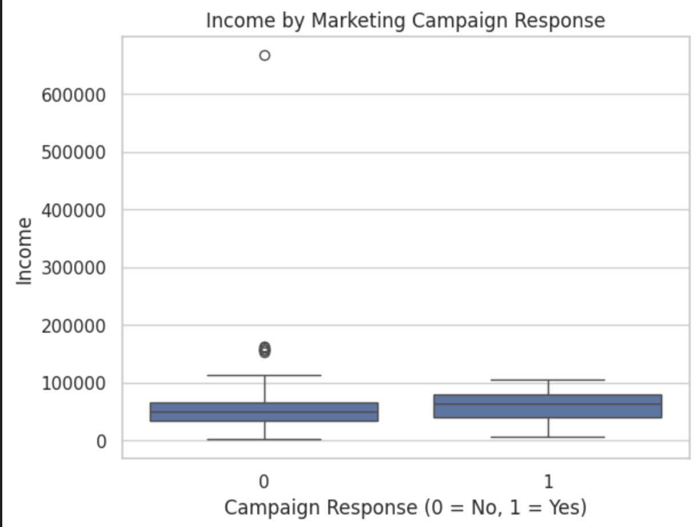
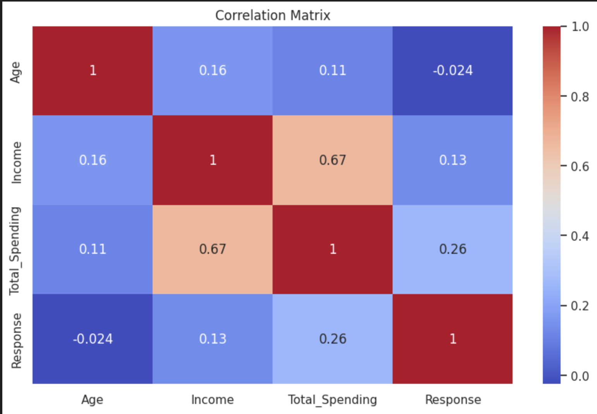
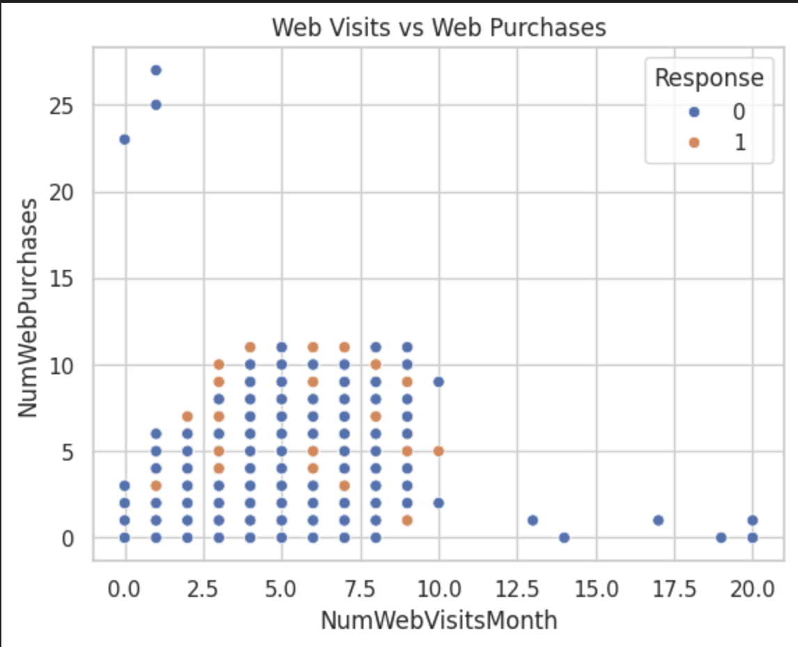

# Customer Marketing Campaign Analysis

## Business Problem
Companies often struggle to identify which customers are most likely to respond to marketing campaigns. Inefficient targeting increases marketing cost and reduces ROI.

## Objective
To analyze customer demographics, purchasing behavior, and digital engagement patterns to identify factors influencing campaign response.

## Methodology
- Data cleaning and preprocessing
- Feature engineering (Age, Total Spending)
- Univariate and bivariate analysis
- Behavioral pattern analysis
- Correlation analysis for predictive insights

## Dataset
Customer Personality Analysis Dataset

## Tools & Technologies
Python, Pandas, Seaborn, Matplotlib

## Key Insights
- High income customers show significantly higher campaign response rates
- Customers with greater total spending are more likely to convert
- High website visits do not always translate into purchases
- Household composition influences marketing responsiveness

## Key Visual Insights

### High-Value Customers Drive Campaign Success
Customers who responded to the marketing campaign exhibit significantly higher total spending compared to non-responders. This suggests that targeting high-value customers can improve campaign conversion rates and maximize marketing ROI.

### Income Influences Campaign Response
Income level shows a noticeable impact on campaign responsiveness. Higher-income customers demonstrate a greater likelihood of accepting marketing offers, indicating income as an important feature for predictive targeting strategies.

### Key Variable Relationships
Correlation analysis highlights strong relationships between income, total spending, and campaign response. These variables can be leveraged to build predictive models that identify customers with high conversion potential.

### Digital Engagement vs Purchases
Although higher website engagement indicates customer interest, it does not consistently translate into purchases. This reveals a behavioral gap between browsing and buying, suggesting the need for improved conversion strategies such as personalized recommendations or targeted promotions.

## Business Impact
These insights help organizations:
- Improve marketing ROI through targeted campaigns
- Identify high-value customer segments
- Reduce unnecessary marketing expenditure
- Enable predictive modeling for campaign success

## Business Recommendations
- Focus marketing campaigns on high-income and high-spending customer segments
- Improve conversion strategies for high website engagement users
- Develop targeted promotional offers based on customer purchasing behavior
- Implement predictive models to optimize campaign targeting

## Future Scope
- Build classification model to predict campaign response
- Implement customer segmentation using clustering
- Develop marketing recommendation system

## Project Structure
- Data Cleaning → Feature Engineering → Visualization → Insight Generation → Predictive Potential
